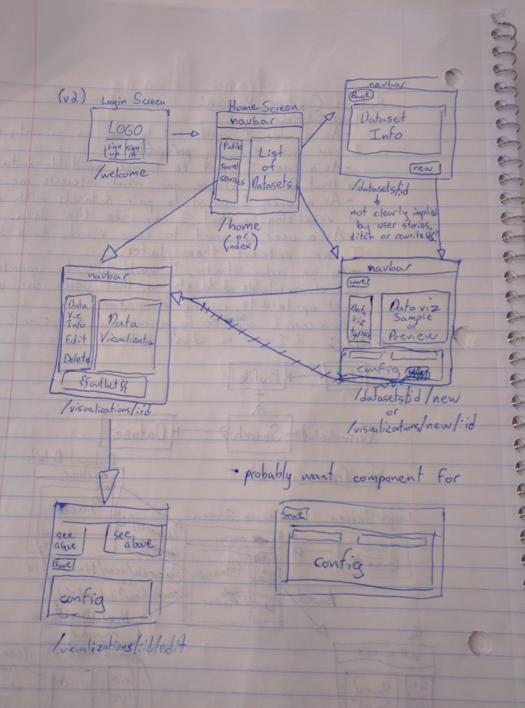

# Visualizr

Visualizr is an app designed to allow users to easily create graphs and other visualizations about their city, using open data sets to explore how neighborhoods change over time.

## User Stories

1. As a user, I want to log into my account so that I can access my data.
2. As a user, I want to browse available datasets, so that I can choose one that interests me.
3. As a user, I want to save visualizations so that I can retrieve or adjust them later.
4. As an administrator, I would like to update the list of available datasets so that users can view new datasets or more current version of old ones.
5. As a user, I would like to be able to share my visualizations so that I can share my conclusions with other people.

#### Epics

These user stories represent long term goals for the application, and will be moved above as they are broken down.

1. As a user, I want to pair datasets with a method of visualizing so that I can see the data.
2. As a user, I would like to select a neighborhood so that I can find and visualize datasets about it.
3. As a user, I would like to view changes in datasets over time so that I can visualize the change in a neighborhood.
4. As a user, I would like to be able to save trends in data so that I can more easily identify other neighborhoods undergoing the same changes.

## Wireframes

