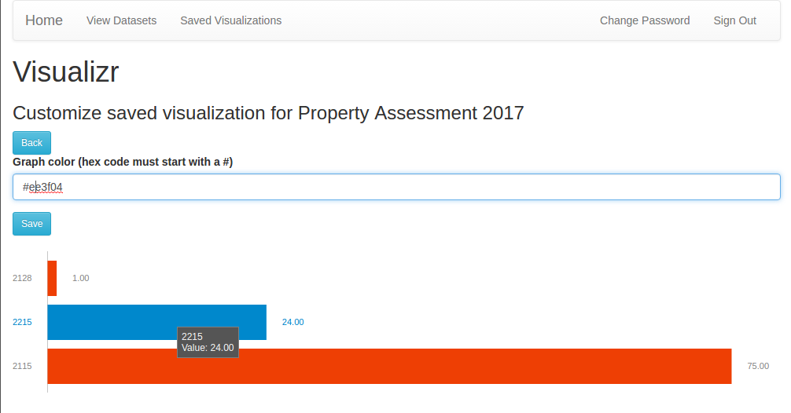

# Visualizr

Visualizr is an app designed to allow users to easily create graphs and other visualizations about their city, using open data sets to explore how neighborhoods change over time. The current version is very basic, allowing users to see only one kind of data set in one particular way, but in the future it will allow users to choose visualization methods and even overlay graphic representations of the datasets over maps of the naighborhoods they concern.

## Screenshot



## User Stories

1. As a user, I want to log into my account so that I can access my data.
2. As a user, I want to browse available datasets, so that I can choose one that interests me.
3. As a user, I want to save visualizations so that I can retrieve or adjust them later.
4. As a user, I would like to be able to share my visualizations so that I can share my conclusions with other people.
5. As an administrator, I would like to update the list of available datasets so that users can view new datasets or more current version of old ones.

#### Epics

These user stories represent long term goals for the application, and will be moved above as they are broken down.

1. As a user, I want to pair datasets with a method of visualizing so that I can see the data.
2. As a user, I would like to select a neighborhood so that I can find and visualize datasets about it.
3. As a user, I would like to view changes in datasets over time so that I can visualize the change in a neighborhood.
4. As a user, I would like to be able to save trends in data so that I can more easily identify other neighborhoods undergoing the same changes.

## Wireframes


## Installation

After cloning this repo to see a local version run:
- `npm install`
- `bower install`
- `ember server`

## Technologies Used

This app relies on Ember (and its dependency HTMLbars) as a front-end framework to manage view states, URL routing, and interaction with the API.

It relies on a very helpful Ember addon, [`ember-charts`](https://github.com/Addepar/ember-charts) for rendering the graphs.

It also relies on Bootstrap and Sass for styling concerns.

## Approach

My approach to this app was to first work on being able to display graphs. Once that was possible, I began to work on saving visualizations. I focused on keeping myself to imposed time limits for working on certain features that were nice to have but not necessary, and also for approaches to solving problems implementing necessary features.

Throughout the development of this app, I tried to focus primarily on making functional code. While pure functionality was my main priority, I tried to design the app in a way that would allow me to add new features in the future with minimal difficulty. Once a feature was working properly, and if I had time remaining in what I had allotted myself for that feature, I would attempt to refactor it into something "better" or "more elegant."

## Unsolved Problems

The main problem that needs to be overcome is the ability to customize what visualization method a user wants to pair with a data set.

## Major hurdles

There was an issue present in a number of components for most of this project, where they did not properly clear form elements when a user navigated away from the page. This was solved by adding init hooks to these components to clear the attributes bound to the values of the form elements, like this:

```js
init() {
  this._super(...arguments);
  this.set('credentials', {});
},
```

Another major hurdle was understanding how Ember handles Data Store objects, and how to properly send requests to the API that required a relationship to another resource.

## Pitch Deck

Apart from the epic user stories, I plan to implement resources for user profiles, visualization methods, and neighborhoods.
